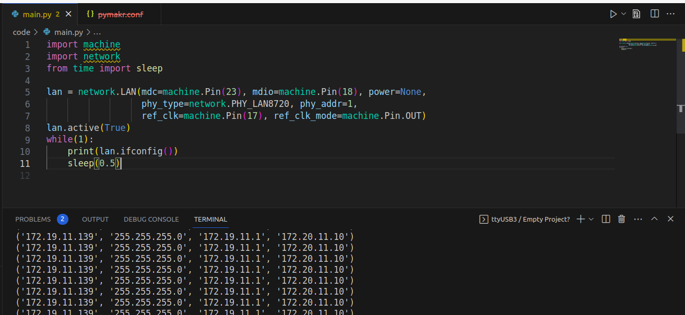

# Esp32-Stick-Micropython-Lan-Example
Hello!
In this repository you can find an example of using Esp32-Stick together with Micropython.
## Micropython Version
First you need to install micropython version that was compiled with IDF 4.4. The crucial things it that LAN() constructor must be able to take ref_clk and ref_clk_mode arguments 
which is not supported in micropython, compiled with older versions.
Since I did't find it in any official releases(official releases are compiled with IDF 4.2), I did the compilation myself following this tutorial: https://www.wemos.cc/en/latest/tutorials/others/build_micropython_esp32.html.
The binary is at micropython folder. 
## The code
The code is pretty straightforward and self explanatory, create LAN, activate it, wait for connection!
## IDE
I used Pymakr together with VSCODE

